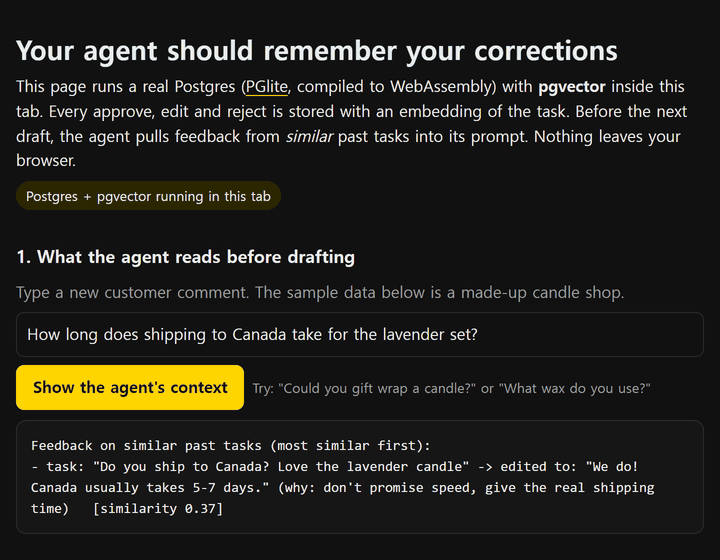
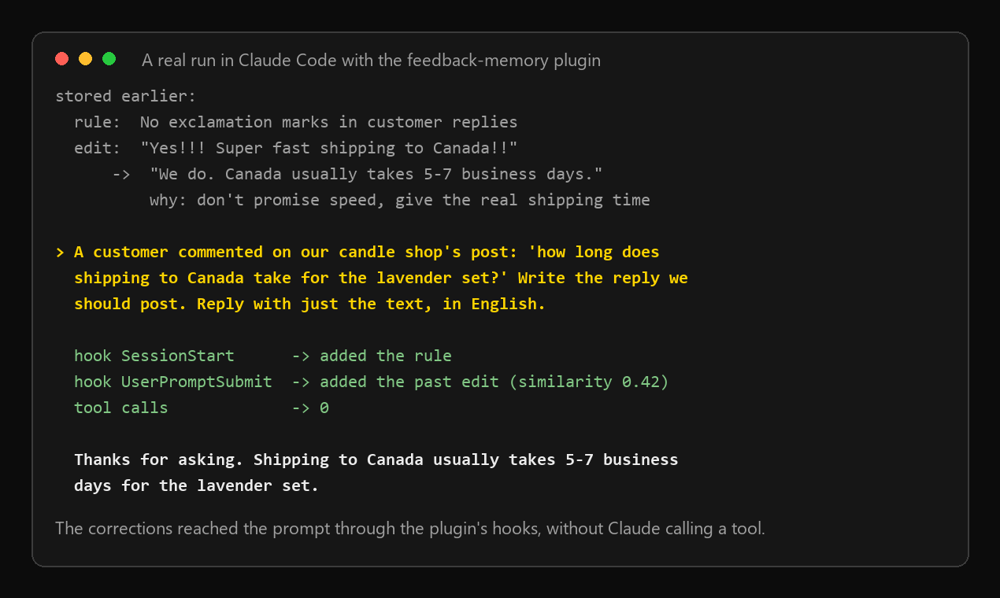
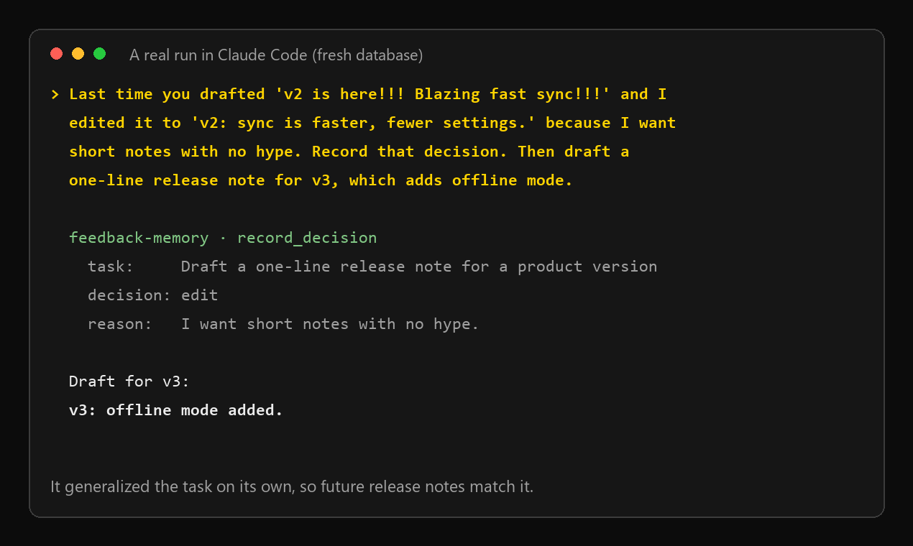
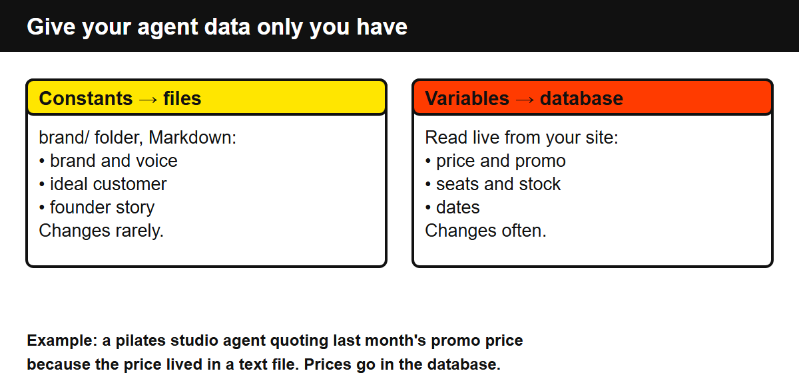
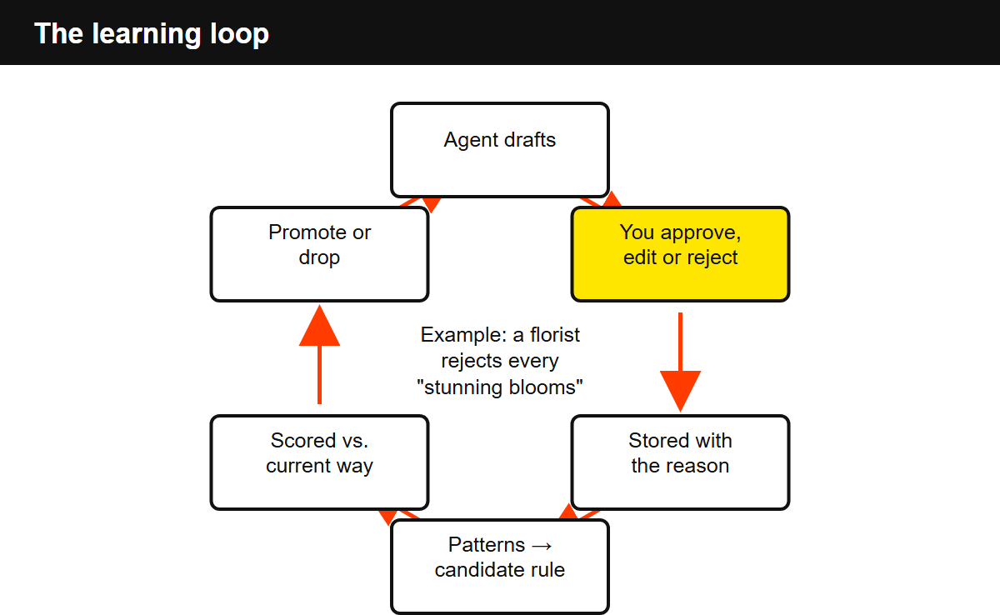

# Self-Learning Agent Setup

[](https://github.com/ssap-pa/self-learning-agent-setup/actions/workflows/test.yml)

A small, practical pattern for making an AI agent **remember your business** and **learn from every correction you give it**. No framework required: a folder of brand files, your existing database, and a feedback table.

I run a one-person education business in Korea this way. Agents (Claude Code, Codex) draft posts and replies. I approve, edit or reject them from my phone. Every decision goes into a database, and the next draft reads that history before it writes a word.

This repo has the minimal schema and the prompts. The full walkthrough is a free 23-page field guide (link at the bottom).

## Try it in one minute

**In your browser, no install:** https://ssap-pa.github.io/self-learning-agent-setup/ (Postgres + pgvector via PGlite and the all-MiniLM-L6-v2 embedding model via Transformers.js, all running in the tab, no API key).



**Locally:**

```
git clone https://github.com/ssap-pa/self-learning-agent-setup
cd self-learning-agent-setup/demo
npm install
npm run demo
```

It starts an in-memory Postgres (PGlite + pgvector), feeds in three days of feedback for a made-up candle shop (one edit, one reject, one plain approval), then prints what the agent would read before its next drafts. No database or API key needed. `npm test` runs the tests the same way.

```
Day 3  new comment: "How long does shipping to Canada take for the lavender set?"
       before drafting, the agent reads:
         Feedback on similar past tasks (most similar first):
         - task: "Do you ship to Canada? Love the lavender candle" -> edited to: "We do! Canada usually takes 5-7 days." (why: don't promise speed, give the real shipping time)

Day 3  new comment: "Could you gift wrap a candle for a birthday?"
       before drafting, the agent reads:
         Feedback on similar past tasks (most similar first):
         - task: "Can you gift wrap the vanilla set for my mom?" -> rejected (why: we don't gift wrap, offer the gift note instead)

Day 3  new comment: "What wax do you use?"
       before drafting, the agent reads:
         (nothing yet: no feedback on anything similar)
```

The demo embeds text by hashing words, so "similar" here means shared words. Run `EMBED=openai OPENAI_API_KEY=... npm run demo` to use real embeddings, or point `Loop` at your own Postgres / Supabase with `pg`.

## Use it in Claude Code, Cursor or Claude Desktop (MCP server)

`feedback-memory` is a small MCP server built on the same loop. Your agent calls `recall_corrections` before it drafts and `record_decision` after you approve, edit or reject. Everything lives in a local Postgres (PGlite + pgvector) in `~/.feedback-memory`, so there's nothing to host.

Claude Code, as a plugin (the easiest way). Your standing rules load when a session starts (and again after `/clear` or compaction), and the closest past corrections are added to each prompt by a hook, so they apply even when Claude doesn't call a tool:

```
/plugin marketplace add https://github.com/ssap-pa/self-learning-agent-setup.git
/plugin install feedback-memory@ssap-pa
```

(The short form `/plugin marketplace add ssap-pa/self-learning-agent-setup` works too if you have an SSH key set up for GitHub.)

In a real run with the plugin, Claude made no tool calls and still answered a new "how long does shipping to Canada take?" comment with "Thanks for asking. Shipping to Canada usually takes 5-7 business days for the lavender set.": the shipping time from a past edit (reason: don't promise speed) and no exclamation marks, from a stored rule.



Claude Code, MCP server only:

```
claude mcp add feedback-memory -- npx -y github:ssap-pa/self-learning-agent-setup
```

Claude Desktop, one click: download [`feedback-memory.mcpb`](https://github.com/ssap-pa/self-learning-agent-setup/releases/latest/download/feedback-memory.mcpb) and open it. The OpenAI key field is optional.

Cursor, or Claude Desktop by hand (under `mcpServers` in the config JSON):

```json
"feedback-memory": { "command": "npx", "args": ["-y", "github:ssap-pa/self-learning-agent-setup"] }
```

Then tell the agent when to use it, e.g. two lines in `CLAUDE.md` / `AGENTS.md`:

```
Before drafting anything I'll review, call recall_corrections with the task and follow what comes back.
When I approve, edit or reject your draft, call record_decision with my reason.
```



Tools: `recall_corrections`, `record_decision`, `add_rule` (standing rules that always come back first), `list_memory`, `forget`. Set `OPENAI_API_KEY` in the server's env to match by meaning (text-embedding-3-small); without it, words are hashed offline (with light stemming, so "shipping" matches "ship") and only shared words match. One database folder per running client (set `FEEDBACK_MEMORY_DIR` if you run several), so install it one way, not as both the plugin and a separate MCP server. `npm test` runs an end-to-end test over stdio, and `npm run bundle` builds the Claude Desktop bundle.

If it helps, a star on the repo helps other people find it, and an issue about what didn't work helps me fix it.

## The problem

Anyone can pay for the same model you use. What nobody else can buy is:

1. what your agent knows about **your** business, and
2. the record of every correction you've given it.

Most people give feedback in chat and lose it. The next session starts from zero, and you fix "stunning blooms" for the tenth time.

## Layer 1: the knowledge layer (what it knows)



| Type | Example | Where it lives |
|---|---|---|
| Constants | Brand, voice, customer, founder story | Markdown files in a `brand/` folder |
| Variables | Price, stock, seats, schedule | Your site's database, read live |
| Large knowledge | Lessons, ebooks, FAQs | Same database, embedded for search (RAG) |

Rules that matter:

- **Files for who you are, database for what's true right now.** Prices in a text file go stale, and the agent quotes last month's promo with confidence.
- **The agent can only say what your admin page stores.** "3 seats left" requires a seats field.
- **Enforce it in code.** A rule that only lives in `AGENTS.md` can be skipped. Programs that run on their own should call the database and search directly.

## Layer 2: the learning loop (how it improves)



1. **Store** every approve (+1), reject (−1) and edit (0, with the correction), linked to the run it judges.
2. **Generate candidates.** Repeated feedback becomes a *proposed* rule, not an active one.
3. **Score** with a rubric per goal.
4. **Compare** the candidate against current behavior.
5. **Promote or drop.**

Plus two details that made it actually work for me:

- **Rules vs. memory.** "Your tone sounds robotic" always applies (rule). "For funeral orders, no emojis" only applies when the situation matches (memory). Memories that keep repeating get promoted.
- **Search feedback by meaning.** Keyword search missed feedback phrased differently. Embeddings pull in corrections from *similar* situations.

And the human part: a Telegram bot sends each draft to my phone with **Approve / Reject / Edit** buttons, and the taps land in the learning database (not just the bot's log). Check that they actually do. Mine silently wasn't storing approvals at first.

## What's here

- [`schema.sql`](schema.sql): Postgres / Supabase tables (`runs`, `feedback` with situation and reason embeddings, `rules`) and `match_feedback()` for similarity search, with pgvector
- [`demo/loop.ts`](demo/loop.ts): the core loop in about 100 lines of TypeScript: store each decision, pull feedback from similar past tasks into the next prompt. Works with `pg` or PGlite
- [`demo/demo.ts`](demo/demo.ts) and [`demo/loop.test.ts`](demo/loop.test.ts): the one-minute demo and tests
- [`prompts.md`](prompts.md): the prompts I use with Claude Code / Codex to build and check each layer

## Start small

- Run one goal with low limits (mine: 1 post and up to 3 replies a day for two weeks).
- Keep approval on until there's nothing left to correct.
- Measure purchases or signups, not likes.

## More

- **Need it across machines or a team, or approvals from your phone?** The free plugin keeps its memory in one folder on one machine. The Self-Learning Agent Kit runs the same loop on your own Postgres / Supabase so every machine and teammate shares one memory, adds a Telegram bot to approve / edit / reject from your phone (every tap is stored before anything publishes), proposes rules from reasons that keep coming back, and ships Python and TypeScript versions of the library + CLI, an MCP server and its own Claude Code plugin whose hooks read that shared database (by meaning, with OpenAI embeddings), an end-to-end example and 28 tests ($39): https://payhip.com/b/grc25
- **Prefer video?** A free 22-minute lesson where I build this system with an agent (Korean audio, English subtitles, no account): https://ssapable.com/courses/ai-agent?lang=en&utm_source=github&utm_medium=readme#free-preview
- **Free field guide (23 pages, PDF):** the full walkthrough with a worked example and a 7-day plan: https://payhip.com/b/QHgfJ
- **The book:** *Just Say "Do It"*, an 11-step playbook for running a one-person business with AI agents (English edition of my Korean course): https://payhip.com/b/xmZvu. Pay what you want this week, and $0 is fine; if you read it, an honest review on that page helps a lot.
- **Want it set up around your business?** Done-for-you automation blueprint: https://payhip.com/b/BzSRC

---

Text and diagrams (this README, `prompts.md`, `img/`) © 2026 AI SSAPABLE, shared under CC BY-NC 4.0. The MIT License in `LICENSE` covers the code: `schema.sql`, `demo/`, `docs/`, `mcp/`, `hooks/`, `bundle/` and `.claude-plugin/`.
